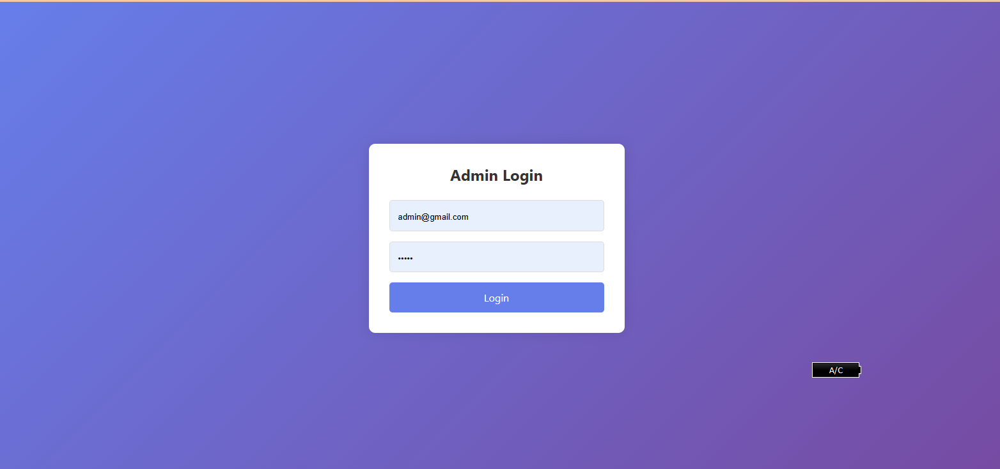
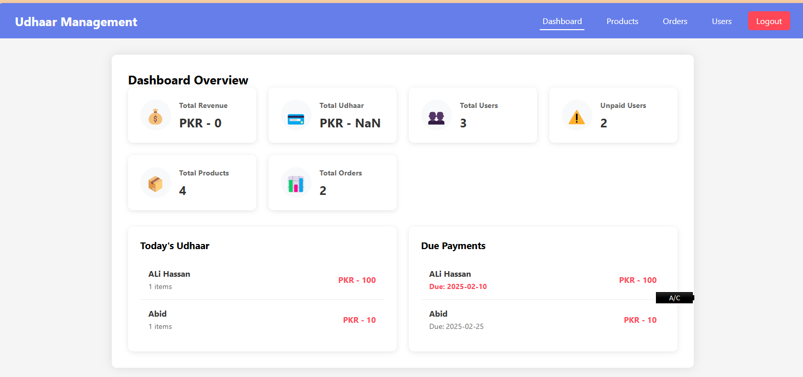
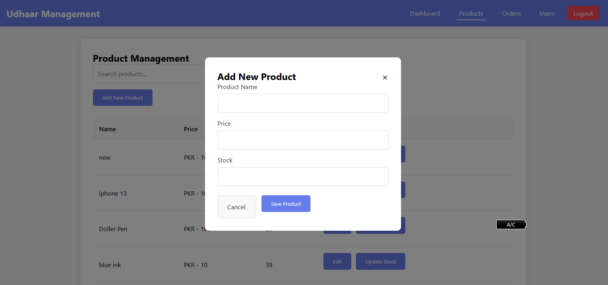
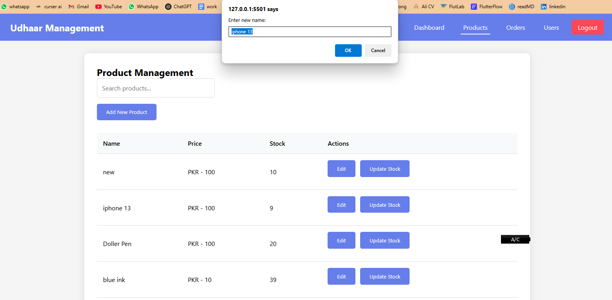
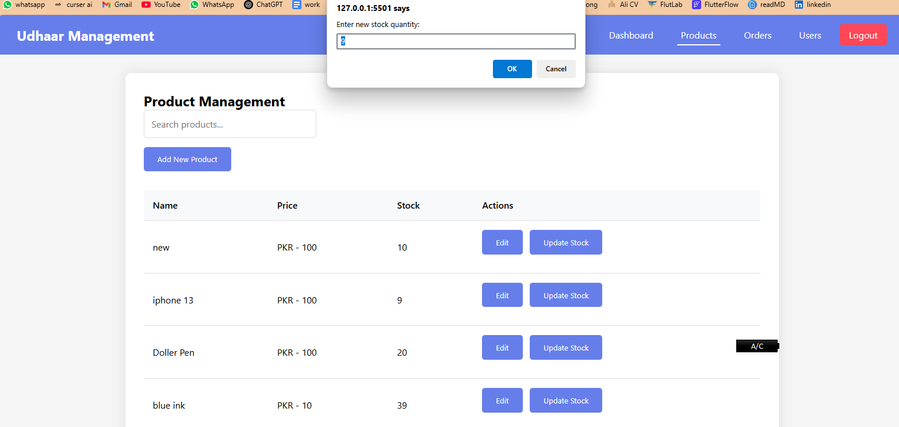
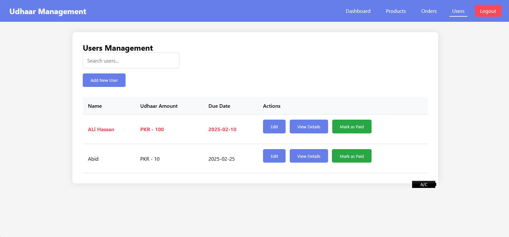
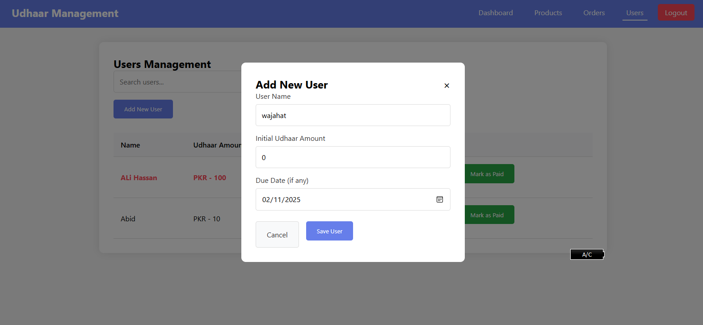
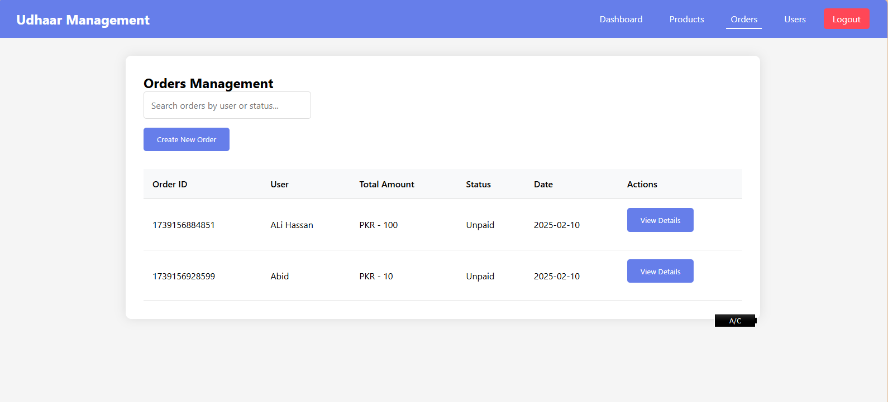
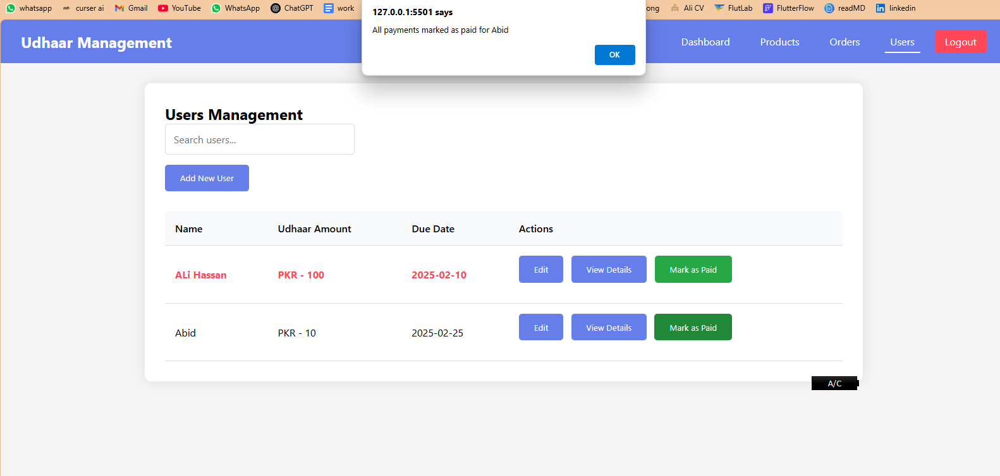

      <h1>  Udhaar Management System</h1>

    
    
    

# Tech Used

A web-based credit management system built with vanilla JavaScript, featuring product management, order tracking, and user credit management.

## 🔴 Live Demo

Check out the live demo: [https://jamalihassan0307.github.io/supermarket-mangment-system/](https://jamalihassan0307.github.io/supermarket-mangment-system/)

### Demo Credentials

- **Email:** admin@gmail.com
- **Password:** admin

## 📸 Screenshots

### User Journey

#### 1. Login Page

_Secure admin authentication interface_

#### 2. Dashboard Overview

_Main dashboard with credit statistics and due payments_

#### 3. Product Management

_Product management interface_

#### 4. Add New Product

_Interface for adding new products_

#### 5. Edit Product

_Edit existing products_

#### 6. Update Stock

_Quick stock updates_

#### 7. User Management

_User credit management_

#### 8. Add New User

_Add new users with credit details_

#### 9. Order Management

_Order tracking and management_

#### 10. Create New Order

_Create new orders for users_

#### 11. Mark as Paid

_Mark credit payments as paid_

## 🚀 Features

- **User Authentication**

  - Secure admin login system
  - Protected routes
  - Session management

- **Product Management**

  - Add new products
  - Edit existing products
  - Update stock levels
  - Search products

- **Credit Management**

  - Track user credits
  - Set due dates
  - Mark payments as paid
  - Credit history

- **Order Management**

  - Create new orders
  - Track order status
  - View order details
  - Search orders

- **Dashboard**
  - Total credit overview
  - Due payments alerts
  - Recent activities
  - Stock alerts

## 🛠️ Built With

- **Frontend**

  - HTML5
  - CSS3
  - Vanilla JavaScript

- **Storage**

  - LocalStorage for data persistence

- **Additional Features**
  - Responsive Design
  - Search Functionality
  - Real-time Updates

## 🙏 Acknowledgments

- [HTML5](https://developer.mozilla.org/en-US/docs/Web/HTML)
- [CSS3](https://developer.mozilla.org/en-US/docs/Web/CSS)
- [JavaScript](https://developer.mozilla.org/en-US/docs/Web/JavaScript)
